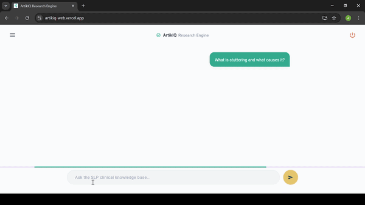
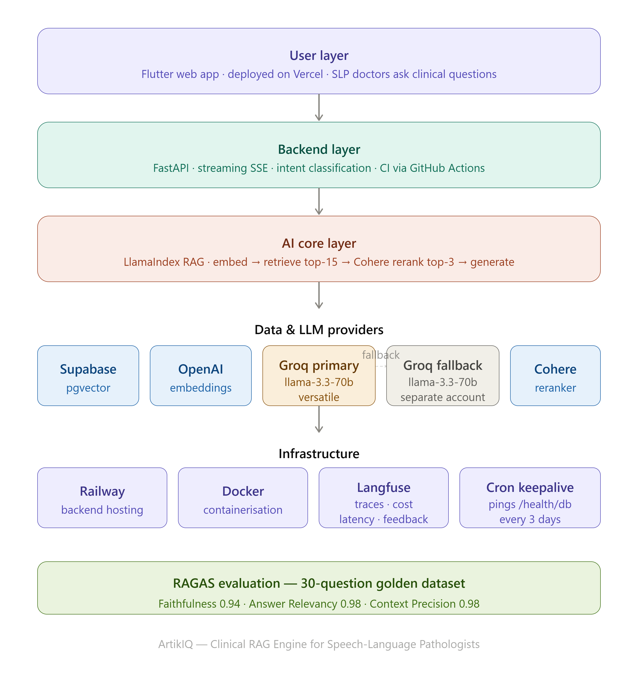

# ArtikIQ — Clinical Research Engine for Speech-Language Pathologists

[](https://github.com/arfakhalidkhan6/artikiq/actions/workflows/ci.yml)

**ArtikIQ** is a production-grade RAG (Retrieval-Augmented Generation) platform that lets Speech-Language Pathologists (SLPs) ask clinical questions in plain language and receive cited, textbook-grounded answers with exact page references.

Built as a portfolio project , ArtikIQ demonstrates end-to-end AI engineering across data ingestion, vector retrieval, LLM generation, evaluation, monitoring, and deployment.

---

## Live Links

| Resource | URL |
|---|---|
| Frontend | https://artikiq-web.vercel.app |
| Backend API | https://artikiq-production-4934.up.railway.app |
| API Docs (Swagger) | https://artikiq-production.up.railway.app/docs |
| GitHub Repo | https://github.com/arfakhalidkhan6/artikiq |



---

## The Problem

Speech-language pathologists regularly need to confirm clinical details from dense academic textbooks mid-session. There is no fast, trustworthy, citation-backed way to search this content. General-purpose AI chatbots answer confidently but without source verification, which is unacceptable in a clinical context.

ArtikIQ solves this by grounding every answer in the actual textbook text, citing the exact page, and refusing to answer from outside the verified source material.

---

## Architecture Overview



```
User Query
    │
    ▼
[Intent Classification] ── Non-clinical? ──▶ Friendly decline, no retrieval
    │
    ▼ Clinical question confirmed
[OpenAI Embedding] — text-embedding-ada-002
    │
    ▼
[Supabase pgvector] — HNSW index, top-15 candidates
    │
    ▼
[Cohere Reranker] — rerank-english-v3.0, narrows to top-3
    │
    ▼
[Groq LLaMA 3.3 70B] — citation-grounded answer generation
    │  (fallback: Groq llama-3.1-8b-instant on separate account)
    ▼
[SSE Streaming] — word-by-word to Flutter frontend
    │
    ▼
[Langfuse] — traces, cost, latency, user feedback
```

---

## Tech Stack

### Backend
| Component | Technology |
|---|---|
| API Framework | FastAPI + Python |
| RAG Engine | LlamaIndex with SemanticSplitterNodeParser |
| Vector Database | Supabase (pgvector + HNSW indexing) |
| Embeddings | OpenAI text-embedding-ada-002 |
| Primary LLM | Groq — LLaMA 3.3 70B Versatile |
| Fallback LLM | Groq — LLaMA 3.3 70B Versatile (separate account for rate limit isolation) |
| Reranker | Cohere rerank-english-v3.0 |
| Monitoring | Langfuse v4 (traces, cost tracking, user feedback) |
| Evaluation | RAGAS (Faithfulness, Answer Relevancy, Context Precision) |
| Containerization | Docker |

### Frontend
| Component | Technology |
|---|---|
| Framework | Flutter Web |
| Auth | Supabase Auth |
| Deployment | Vercel |

### Infrastructure
| Component | Technology |
|---|---|
| Backend Hosting | Railway (auto-deploy on GitHub push) |
| CI/CD | GitHub Actions |
| DB Keep-alive | cron-job.org → `/health/db` every 3 days |

---

## Key Engineering Decisions

### 1. LLM-Based Junk Filter in Ingestion

Raw PDF chunking produces noise: bibliography entries, bare page numbers, figure captions without context, and personal author essays. Before storing any chunk, a lightweight LLM call classifies each one as `USABLE` or `JUNK`. Of 1,187 chunks generated from the source textbook, 163 (13.7%) were filtered out before reaching the vector database.

### 2. Chapter Metadata and Page Offset Correction

The source PDF's internal page numbering was offset by 5 from the book's actual printed page numbers. ArtikIQ corrects this during ingestion using a chapter lookup table built from the PDF's embedded table of contents, so citations like "Page 298" match what the user actually finds when they open the book.

### 3. Two-Stage Retrieval (Vector Search + Reranker)

Vector similarity search retrieves the top-15 candidate chunks by embedding cosine distance. Cohere's reranker then re-scores all 15 specifically for relevance to the exact question, keeping only the best 3 for generation. This separates speed (vector search is fast but imprecise) from precision (reranking is slower but more accurate).

### 4. Clinical Intent Classification

Before retrieval or generation, a fast LLM call classifies whether the user's input is a clinical question or casual/off-topic input. Off-topic messages return a friendly decline with zero retrieval or generation cost.

### 5. Dual Groq Accounts for Fallback

The primary LLM (LLaMA 3.3 70B) runs on one Groq account. A fallback (LLaMA 3.1 8B Instant) runs on a completely separate Groq account. This provides true rate-limit isolation: if the primary account exhausts its daily quota, requests automatically fall to the secondary account rather than returning errors to users.

### 6. SSE Streaming

The backend generates answers via Server-Sent Events, streaming tokens as they arrive from Groq. The Flutter frontend renders text progressively, with citation cards appearing only after the first text has been received.

### 7. Database Keep-alive

A dedicated `/health/db` endpoint performs a lightweight `SELECT 1` query against Supabase with zero LLM calls. A cron job pings this endpoint every 3 days, preventing Supabase from pausing on the free tier and ensuring the app is always ready when a clinician needs it.

---

## RAGAS Evaluation Results

Evaluated against a 30-question golden dataset built manually from the source textbook (Human Communication Disorders, Anderson & Shames, 8th Edition). Ground truth answers were written from the actual book text — not synthetically generated — to ensure evaluation was grounded in real source material.

| Metric | Baseline (before reranker) | After Reranker | Improvement |
|---|---|---|---|
| Faithfulness | 0.8181 | 0.9392 | +0.121 |
| Answer Relevancy | 0.7536 | 0.9813 | +0.228 |
| Context Precision | 0.7667 | 0.9778 | +0.211 |

Context Precision was the weakest baseline metric and the primary target of the reranker — it improved by 0.21 points, nearly reaching a perfect score.

---

## Langfuse Monitoring

Every query is logged as a trace in Langfuse, capturing:

- Full input query and generated answer
- Token usage (input + output) per query
- Per-query cost in USD (calculated using Groq's live pricing: $0.59/M input tokens, $0.79/M output tokens)
- Latency breakdown across embedding, reranking, and generation steps
- User feedback (thumbs up/down) linked to the specific trace

---

## Project Structure

```
artikiq/
├── backend/
│   ├── api/
│   │   └── routes.py           # FastAPI endpoints: /api/query, /api/query/stream, /api/feedback, /health/db
│   ├── core/
│   │   ├── config.py           # Single source of truth for all environment variables
│   │   └── chapters.py         # Chapter-to-page-range lookup table + page offset correction
│   ├── rag/
│   │   └── rag_engine.py       # Full RAG pipeline: intent check → embed → retrieve → rerank → generate
│   ├── ingestion/
│   │   └── ingest.py           # PDF ingestion with LLM junk filter, chapter tagging, page correction
│   ├── models/
│   │   └── schemas.py          # Pydantic request/response models
│   ├── evaluation/
│   │   ├── golden_dataset.py   # 30-question ground truth evaluation set
│   │   ├── ragas_eval.py       # RAGAS evaluation script
│   │   ├── inspect_chunks.py   # Random chunk sampling for data quality checks
│   │   └── upload_to_langfuse.py # One-time Langfuse dataset upload
│   ├── data/                   # Source PDF (not committed to git)
│   ├── Dockerfile
│   ├── main.py
│   └── requirements.txt
├── frontend/
│   └── lib/
│       ├── screens/            # ChatScreen, AuthGate, SignIn, SignUp
│       ├── widgets/            # ChatMessage, ConversationView, SourcePanel, etc.
│       ├── models/             # RagResponse, Citation
│       └── services/           # QueryService (non-streaming + SSE streaming)
├── .github/
│   └── workflows/
│       └── ci.yml              # GitHub Actions: lint (ruff) + app import check
├── docs/
│   ├── architecture.png        # 5-layer architecture diagram
│   └── demo.gif                # Demo recording
├── docker-compose.yml
└── README.md
```

---

## API Endpoints

| Method | Endpoint | Description |
|---|---|---|
| GET | `/` | Health check — confirms API is online |
| POST | `/api/query` | Non-streaming query — returns complete JSON response |
| POST | `/api/query/stream` | SSE streaming query — streams answer tokens as they arrive |
| POST | `/api/feedback` | Records thumbs up/down against a Langfuse trace ID |
| GET | `/health/db` | Lightweight Supabase ping — no LLM calls, used by cron keep-alive |

Full interactive documentation: https://artikiq-production.up.railway.app/docs

---

## CI/CD

GitHub Actions runs on every push to `main`:

1. Installs Python dependencies from `requirements.txt`
2. Runs `ruff` for code formatting and lint checks
3. Validates that the FastAPI app imports cleanly without errors

Railway auto-deploys the backend on every successful push to `main`. Vercel auto-deploys the Flutter web build on every push.

---

## Local Setup

### Prerequisites

- Python 3.11+
- Flutter 3.x
- Docker (optional, for containerized backend)

### Environment Variables

Create `.env` in the project root:

```env
SUPABASE_CONNECTION_STRING=your_supabase_connection_string
OPENAI_API_KEY=your_openai_key
GROQ_API_KEY=your_primary_groq_key
GROQ_API_KEY_FALLBACK=your_fallback_groq_key
COHERE_API_KEY=your_cohere_key
LANGFUSE_SECRET_KEY=sk-lf-...
LANGFUSE_PUBLIC_KEY=pk-lf-...
LANGFUSE_HOST=https://cloud.langfuse.com
```

### Backend

```bash
cd backend
python -m venv venv
venv\Scripts\activate        # Windows
pip install -r requirements.txt
uvicorn main:app --reload
```

### Ingestion (first time only)

```bash
cd backend
python -m ingestion.ingest
```

### Frontend

```bash
cd frontend
flutter pub get
flutter run -d chrome
```

### Docker

```bash
docker-compose up --build
```

---

## Evaluation

Run the full 30-question RAGAS evaluation:

```bash
cd backend
python -m evaluation.ragas_eval
```

Inspect random database chunks for data quality:

```bash
python -m evaluation.inspect_chunks
```

---

## Source Material

The knowledge base is built from:

**Human Communication Disorders: An Introduction**
Noma B. Anderson & George H. Shames — 8th Edition (Pearson)

Covers 15 clinical chapters including articulatory and phonological disorders, stuttering, voice disorders, aphasia, AAC, swallowing disorders, hearing disorders, and audiologic rehabilitation.

---

## What I Learned Building This

This was my first production AI engineering project, built from scratch without tutorials — only documentation and hands-on debugging.

Key engineering lessons:

**Data quality is not a one-time setup.** Raw PDF chunking produces noise that is invisible from the outside but quietly degrades retrieval quality. Manual chunk inspection, automated junk filtering, and page number correction were all necessary before evaluation numbers meant anything.

**Evaluation requires real ground truth.** RAGAS scores are only meaningful if the ground truth was written from the actual source material, not generated by another AI. I built the 30-question golden dataset by reading the textbook directly.

**Measure before and after.** Adding a reranker improved context precision from 0.77 to 0.98. Without the evaluation pipeline, this improvement would have been invisible — just a vague sense that answers seemed better.

**Production systems need resilience.** Rate limits, connection timeouts, and API failures happen. Every failure mode in ArtikIQ has a handler: Groq fallback for rate limits, database keep-alive cron job for Supabase free tier, graceful SSE error events for streaming failures.

---

## Author

**Arfa Khalid**
Data Science Student — Riphah International University, Lahore, Pakistan
[LinkedIn](https://www.linkedin.com/in/arfa-khalid-machinelearning) · [GitHub](https://github.com/arfakhalidkhan6)